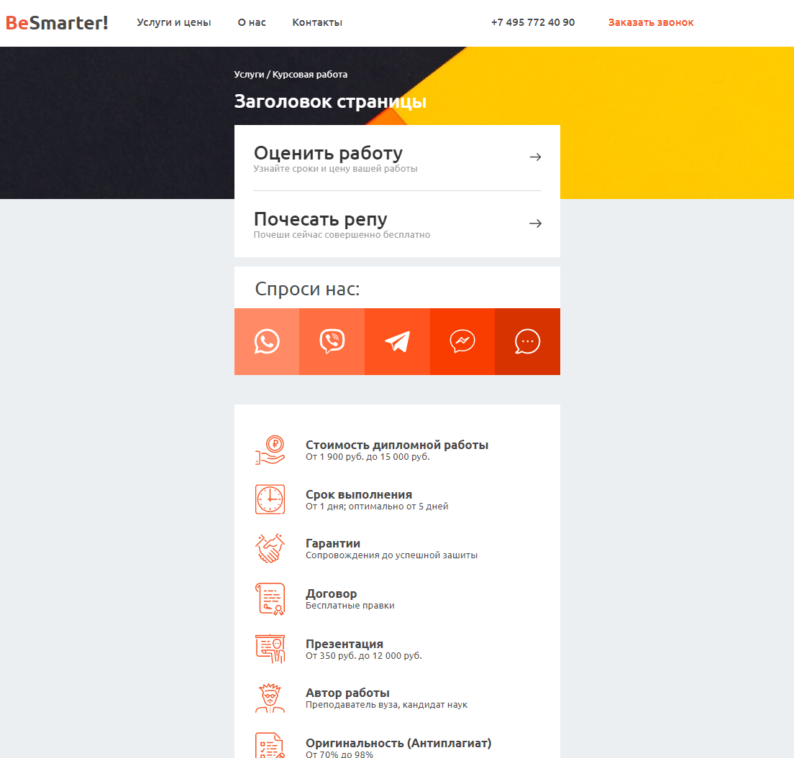

# Страница

Все страницы состоят из блоков, описание которых есть в папке `/manual/blocks`.
Из этих блоков можно собрать любую необходимую страницу.
Другого подхода к созданию дизайна страниц тут не предусмотрено.



## Расположение

Страницы размещены в папке `/pages`, где имя файла и путь к нему соответствуют
адресу, по которому он будет доступен. Например, страница `/about` будет 
находиться в файле `/pages/about.js`. Также можно использовать папки. 

## Код
Код страницы требует подклчения используемых компонентов, а также
требует определённых контейнеров для нормального отображения.

```jsx
import Wrapper from 'components/Wrapper';
import Title from 'components/common/Title';
import NavRow from 'components/common/NavRow';
import MessBlock from 'components/common/MessagersBlock';
import InfoBlock from 'components/common/InfoBlock';
import ImageBlock from 'components/common/ImageBlock';
import infoBlockConfig from 'components/config/infoBlock/diplom'

const page = () => (
    <Wrapper title=":тут title который в head:">
        <div className="wrapper bg bg-c2 bg-img bg-img4">
            <section className="breadcrumbs">
                <div className="inner">
                    <Link href="/pricing">
                        <a>Услуги</a>
                    </Link>
                    <span> / </span>
                    <Link href="/course">
                        <a>Курсовая работа</a>
                    </Link>
                </div>
            </section>

            <section className="main-title">
                <div className="inner">
                    <h1>Заголовок страницы</h1>
                </div>
            </section>

            <section className="block-nav">
                <NavRow title="Оценить работу" description="Узнайте сроки и цену вашей работы" url='#'/>
                <NavRow title="Почесать репу" description="Почеши сейчас совершенно бесплатно" url='/'/>
            </section>
            <MessBlock/>
            <InfoBlock infoBlockConfig={infoBlockConfig}/>

            <ImageBlock imageSrc={require('static/images/block/a.jpg')}/>
```

## Элементы
### Wrapper
Делает всякую важную логику, плюс параметр `title` позволяет задать тег `<title` который пойдёт в шапку.
Следующий после него элемент, должен быть `<div>` с классом `wrapper`
и крайне желательно с классом `bg`.

Дополнительно можно классами задать цвет верхней плашки и картинку на ней.
Плашка рисуется псевдоэлементом `::before`, поэтому напрямую задать цвет и бэкграунд
не получится.
 
Доступные классы для задания цвета подложки: `bg-c1`, `bg-c2` и `bg-c3`.

Для задания картинки нужно установить класс `bg-img` и один из классов с картинками
с `bg-img1` по `bg-img5`.

### Breadcrumbs
Хлебные крошки идут над заголовком.
```jsx
<section className="breadcrumbs">
    <div className="inner">
        <Link href="/pricing">
            <a>Услуги</a>
        </Link>
        <span> / </span>
        <Link href="/course">
            <a>Курсовая работа</a>
        </Link>
    </div>
</section>
```

### Заголовок
Заголовок идёт после breadcumbs, если они есть.
```jsx
<section className="main-title">
    <div className="inner">
        <h1>Заголовок страницы</h1>
    </div>
</section>
```


